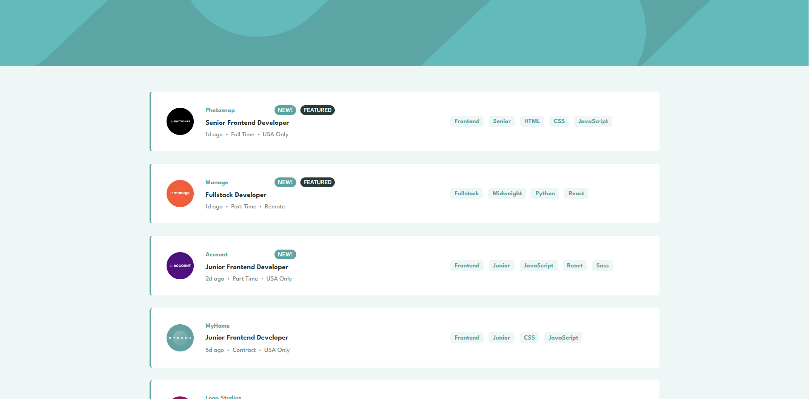
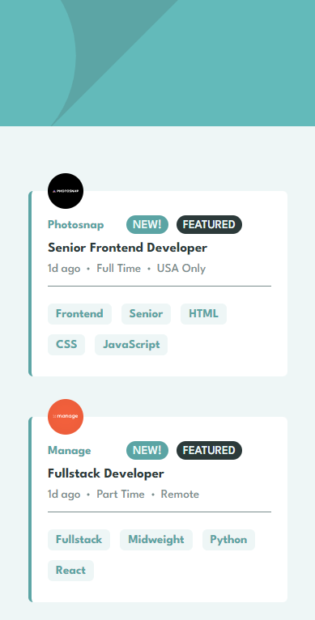

# Static-Job-Listings

This is the solution for Frontend mentor's static job listings challenge

# Interactive-Comments-Section

This is a solution to the [Static job listings challenge on Frontend Mentor](https://www.frontendmentor.io/challenges/job-listings-with-filtering-ivstIPCt).

## Table of contents

- [Overview](#overview)
  - [Features](#Features)
  - [Screenshot](#screenshot)
  - [Links](#links)
- [Author](#author)
- [My process](#my-process)
  - [Built with](#built-with)
  - [What I learned](#what-i-learned)

## Overview

### Features

Users should be able to:

- View the optimal layout for the site depending on their device's screen size
- See hover states for all interactive elements on the page
- Filter job listings based on the categories

### Screenshot

### Mobile Screenshot

### Links

- Solution URL: [Solution](https://github.com/wojciech94//Static-Job-Listings/)
- Live Site URL: [Site](https://wojciech94.github.io/Static-Job-Listings/)

## Author

- Website - [Wojciech94](https://github.com/wojciech94)
- Frontend Mentor - [@wojciech94](https://www.frontendmentor.io/profile/wojciech94)

## My process

### Built with

- Semantic HTML5 markup
- CSS custom properties
- SASS
- Flexbox
- RWD
- BEM architecture
- Mobile-first workflow
- Vanilla Javascript
- JSON data fetch
- Items filtering

### What I learned

- Improved using classes and DOM manipulation
- How to dynamically filter data
